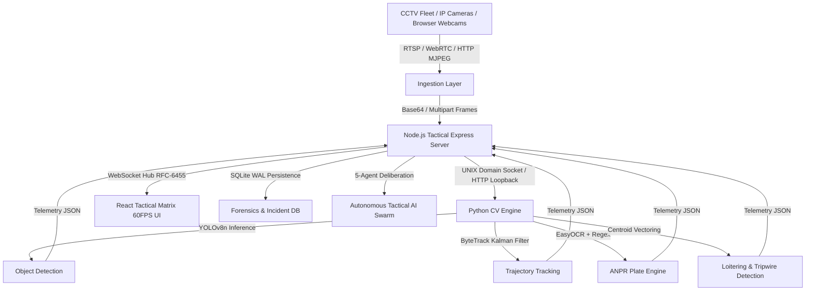

# SEEMADRISHTI AI — System Architecture Specification
**Smart India Hackathon (SIH26187) | Team: IQ100**

---

## 1. High-Level Architectural Overview

SEEMADRISHTI AI is an enterprise-grade tactical command matrix and automated surveillance platform designed for perimeter defense, strategic checkpoints, and border operations.

---

## 2. Core Architectural Pillars

### 2.1 9-Channel Concurrent Matrix
- Renders 9 independent real-time surveillance streams in a 3x3 tactical layout with low-latency hardware canvas acceleration.
- Dynamic layout toggle allows operators to dynamically switch between **2x2 Quad Focus**, **3x3 Tactical Grid**, and **4x4 Fleet Surveillance**.

### 2.2 Python Computer Vision Subsystem
- **YOLOv8 Detector**: Runs `yolov8n.pt` for ultra-low latency inference (30-45ms on CPU, 6-9ms on CUDA GPU).
- **ByteTrack Tracker**: Preserves unique track IDs across camera occlusions with anti-flicker thresholding.
- **ANPR Engine**: Multi-stage OCR with bilateral filtering, CLAHE contrast enhancement, and strict Indian RTO + Bharat Series regex verification.
- **Geospatial Behavior Engine**: Evaluates loitering dwell times, polygon intrusion violations, and directional virtual tripwires.

### 2.3 Real-Time WebSocket Infrastructure
- Broadcasts detected bounding boxes, license plates, alerts, and system telemetry to operators with sub-50ms glass-to-glass latency.
- Heartbeat verification keeps edge camera ingestion connections resilient under adverse network conditions.

### 2.4 Cryptographic Forensics & Chain-of-Custody
- All captured incident snapshots, bounding box telemetry, and operator identity tokens are hashed via **SHA-256**.
- Generates court-admissible forensic packages with digital tamper-detection stamps.
